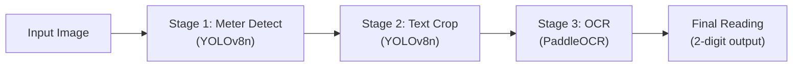

[handover_document_digital_meter_pipeline.md](https://github.com/user-attachments/files/30328648/handover_document_digital_meter_pipeline.md)
# VIM4 NPU Meter Reading Pipeline — Handover Document

**Project:** Automated Meter Reading via VIM4 NPU  
**Board:** Khadas VIM4 (Amlogic A311D2, 5 TOPS NPU)  
**Location on Board:** `/data/summerint26/models/cpy/`  
**Date:** July 2026

---

## 1. Pipeline Overview

The pipeline reads a photograph of a meter and extracts the numeric reading displayed on it. It runs as a 3-stage sequential process, each stage using the onboard NPU for inference:



| Stage | Model | Input Size | NPU Format | Binary/Script |
|-------|-------|-----------|------------|---------------|
| 1. Meter Detect | YOLOv8n | 640×640 | INT8 `.adla` | `meter_detect/build_fixed/yolov8n` |
| 2. Text Crop | YOLOv8n | 640×640 | INT8 `.adla` | `meter_crop/build_fixed/yolov8n` |
| 3. OCR | PaddleOCR | 320×48 | INT16 `.adla` | `onnx_output/x.py` (Python + KSNN) |

**Orchestrator:** `pipeline_runner.cc` — a C++ program that calls each stage via subprocess, handles image pre-processing (letterboxing), collects results, and reports timing.

---

## 2. Directory Structure

```
/data/summerint26/models/cpy/
├── pipeline_runner.cc          # ← Main orchestrator (MODIFIED)
├── pipeline_runner              # ← Compiled binary
├── meter_detect/                # Stage 1: Meter detection
│   ├── main.cc                  # Source (NOT modified)
│   ├── data/best_int8.adla      # YOLOv8n model
│   ├── build_fixed/yolov8n      # Compiled binary
│   └── debug/                   # Output: meter_crop_*.jpg
├── meter_crop/                  # Stage 2: Text region crop
│   ├── main.cc                  # Source (MODIFIED — bbox padding)
│   ├── data/best_int8.adla      # YOLOv8n model
│   ├── build_fixed/yolov8n      # Compiled binary
│   └── debug/                   # Output: text_crop_*.jpg
├── onnx_output/                 # Stage 3: OCR recognition
│   ├── x.py                     # Python OCR script (NOT modified)
│   ├── inference_int16.adla     # ← REPLACED with newocr model
│   ├── libnn_ppocr_rec.so       # ← REPLACED with newocr library
│   ├── inference_int16.adla.old # Backup of original model
│   ├── libnn_ppocr_rec.so.old   # Backup of original library
│   ├── en_dict.txt              # 96-char dictionary (unchanged)
│   └── results/ocr_result.txt   # OCR output per run
├── newocr/                      # New OCR model source (reference)
│   └── onnx_output/
│       ├── inference_int16.adla # The new model (copied to onnx_output/)
│       ├── libnn_ppocr_rec.so   # The new library (copied to onnx_output/)
│       ├── main.c               # Generic NNSDK test harness (not used)
│       └── config.h             # Model shape: input(1,48,320,3) output(1,40,97)
├── pipeline_debug/              # Intermediate images per run
│   ├── meter_detect_input_640x640.jpg
│   ├── meter_crop_input_640x640.jpg
│   └── ocr_preprocessed_*_320x48.jpg
├── pipeline_results/            # Final outputs per run
│   ├── final_reading.txt
│   ├── ocr_crop_*.txt
│   └── total_pipeline_time.txt
└── newmeter/                    # Test images
```

---

## 3. All Changes Made (vs. Vanilla Pipeline)

### 3.1 `pipeline_runner.cc` — Refactored & Optimized

The original `pipeline_runner.cc` (458 lines) was refactored down to ~420 lines with 9 specific optimizations:

#### Code Quality
- **Deduplicated headers** and removed unused `<regex>` include.
- **Added `reserve()` to `shell_quote()`** to minimize string reallocations.
- **Replaced aggregate brace-initialization** with explicit constructors in `CommandResult` struct (C++11 compatibility fix — structs with default member initializers are not aggregates in C++11).

#### Performance
- **Implemented `copy_file()`** — archives debug images via raw byte copy instead of `cv::imread()` → `cv::imwrite()` round-trips (avoids unnecessary JPEG decode/encode).
- **Fixed `letterbox()` interpolation** — uses `floor` → `round` for dimension calculation and selects `INTER_AREA` (downscale) vs `INTER_CUBIC` (upscale) based on scale factor.
- **Single-pass `parse_stage_timings()`** — scans command output once to extract all three timing values instead of multiple passes.

#### Bug Fixes
- **Stale crop cleanup** — Added `unlink()` calls at pipeline start to delete leftover `meter_crop_*.jpg` and `text_crop_*.jpg` from previous runs. Without this, re-running the pipeline on a new image that produces fewer detections would silently use old crops.
- **Hardcoded venv Python path** — Changed `python3` to `/data/summerint26/venv/bin/python3` in the OCR command. The `popen()` shell doesn't inherit the user's conda/venv environment, so the system `python3` (which lacks `cv2`) was being used.

#### Output Changes
- **OCR readings truncated to 2 digits** — The last digit from OCR is typically the unit symbol or a misread, so `line.substr(0, 2)` keeps only the first two characters.
- **Removed WALL CLOCK TIME** from the final timing summary (both console and file output) since it was confusing — it included Python boot and subprocess overhead that isn't "processing" time.
- **Removed duplicate report files** (`readings_report.txt`, `stage_time_totals.txt`) and dead code.

#### Key Code Locations

```diff
# Stale crop cleanup (after ensure_output_dirs())
+ for (const auto &f : glob_files(kMeterDetectDir + "/debug/meter_crop_*.jpg"))
+     unlink(f.c_str());
+ for (const auto &f : glob_files(kMeterCropDir + "/debug/text_crop_*.jpg"))
+     unlink(f.c_str());

# Hardcoded venv python
- "cd " + shell_quote(kOcrDir) + " && python3 x.py " + ...
+ "cd " + shell_quote(kOcrDir) + " && /data/summerint26/venv/bin/python3 x.py " + ...

# 2-digit OCR truncation (after reading ocr_result.txt)
+ if (line.size() > 2) {
+     line = line.substr(0, 2);
+ }
```

---

### 3.2 `meter_crop/main.cc` — Bounding Box Padding

The YOLO-detected text bounding boxes were too tight, causing text on the right side to be clipped before OCR. Added **15% horizontal and 10% vertical padding** to each detection box before cropping:

```diff
# After computing left/right/top/bot from YOLO output:
+ int box_w = right - left;
+ int box_h = bot - top;
+ int pad_x = (int)(box_w * 0.15);
+ int pad_y = (int)(box_h * 0.10);
+ left  -= pad_x;
+ right += pad_x;
+ top   -= pad_y;
+ bot   += pad_y;
```

The existing safety clamps (`if (left < 0) left = 0;` etc.) prevent out-of-bounds crashes.

---

### 3.3 OCR Model Swap

The original OCR model had a conversion error and produced incorrect readings. Replaced with the model from `newocr/onnx_output/`:

| File | Action |
|------|--------|
| `onnx_output/inference_int16.adla` | **Replaced** with `newocr/onnx_output/inference_int16.adla` |
| `onnx_output/libnn_ppocr_rec.so` | **Replaced** with `newocr/onnx_output/libnn_ppocr_rec.so` |
| `onnx_output/inference_int16.adla.old` | Backup of original |
| `onnx_output/libnn_ppocr_rec.so.old` | Backup of original |

Both models have identical input/output shapes (`input: 1×48×320×3 FLOAT`, `output: 1×40×97 FLOAT`), so the existing `en_dict.txt` (96 characters + 1 blank = 97 classes) and `x.py` script work without any code changes.

---

## 4. Build & Run Instructions

### Prerequisites
- OpenCV 4 headers: `/usr/include/opencv4`
- OpenCV 4 libraries: `/usr/lib/aarch64-linux-gnu/`
- Python venv with `cv2`, `numpy`, `ksnn`: `/data/summerint26/venv/`
- AML NNSDK libraries (already linked in `meter_detect` and `meter_crop` builds)

### Compile the Pipeline Runner
```bash
cd /data/summerint26/models/cpy
g++ -O2 -std=c++11 pipeline_runner.cc -o pipeline_runner \
  -I/usr/include/opencv4 \
  -L/usr/lib/aarch64-linux-gnu \
  -lopencv_core -lopencv_imgproc -lopencv_imgcodecs
```

### Compile meter_crop (if `main.cc` was changed)
```bash
cd /data/summerint26/models/cpy/meter_crop/build_fixed
cmake .. && make
```

### Run the Pipeline
```bash
cd /data/summerint26/models/cpy
./pipeline_runner /path/to/meter_image.jpg
```

### Output
- `pipeline_results/final_reading.txt` — Per-crop readings + combined reading
- `pipeline_results/ocr_crop_*.txt` — Individual 2-digit readings per text crop
- `pipeline_results/total_pipeline_time.txt` — Timing breakdown
- `pipeline_debug/` — All intermediate images for visual inspection

---

## 5. Current Performance

| Metric | Value |
|--------|-------|
| Pre-process (OpenCV letterbox, resize) | ~500 ms |
| NPU Inference (all 3 stages combined) | ~73 ms |
| Post-process (YOLO NMS + CTC decode) | ~45 ms |
| **Total Processing Time** | **~620 ms** |
| Python/Subprocess Overhead | ~1,600 ms |
| **Total Wall Clock Time** | **~2,200 ms** |

> [!IMPORTANT]
> **73% of the wall-clock time is overhead** (Python cold-start, subprocess spawning, disk I/O between stages), not actual computation. This is the #1 optimization target.

---

## 6. Known Issues & Limitations

1. **Python cold-start overhead** — Every OCR inference call boots up Python, imports `cv2`/`numpy`/`ksnn`, and loads the model from disk. This adds ~800ms per OCR call.
2. **Disk I/O between stages** — Intermediate images are written to disk as JPEGs and read back. This is slow and introduces quality loss from JPEG compression.
3. **Hardcoded venv path** — `/data/summerint26/venv/bin/python3` is hardcoded in `pipeline_runner.cc`. If the venv moves, update line ~328.
4. **OCR truncation is naive** — `substr(0, 2)` assumes the first two characters are always the meaningful digits. If the model outputs a leading space or symbol, this will break.
5. **No error recovery** — If any stage fails (e.g., no meter detected), the pipeline exits immediately. There is no retry or fallback logic.

---

## 7. Recommended Next Steps (For Future Developers)

### High Priority — Architecture

| Optimization | Expected Impact | Effort |
|-------------|----------------|--------|
| **Unified single-process C++ pipeline** — Load all 3 models once at startup, pass images through RAM, eliminate all subprocess/Python overhead | Wall clock: **2200ms → ~600ms** | High |
| **Zero-copy memory passing** — Pass `cv::Mat` directly between stages instead of writing/reading JPEGs to disk | Pre-process: **500ms → ~50ms** | Medium |
| **Persistent Python process** — Keep `x.py` running as a daemon/socket server instead of cold-starting it per image | OCR overhead: **800ms → ~50ms** | Medium |

### Medium Priority — Model

| Optimization | Expected Impact | Effort |
|-------------|----------------|--------|
| **INT8 quantization for OCR** — Current model is INT16; converting to INT8 halves memory bandwidth | OCR inference: **~2x faster** | Low |
| **Model pruning** — Remove unused neurons (meter digits are a narrow domain) | All stages: **~30-50% faster** | Medium |
| **End-to-end text spotter** — Replace 3 models with 1 (e.g., PGNet) | Eliminates 2 NPU calls entirely | High |

### Low Priority — Quality

| Optimization | Expected Impact | Effort |
|-------------|----------------|--------|
| **Larger/diverse training dataset** — More meter types, lighting conditions, angles | Better accuracy, fewer misreads | Medium |
| **Parallel stage execution** — Run independent crops through OCR simultaneously | ~2x OCR throughput for multi-crop | Low |
| **Adaptive bbox padding** — Use aspect-ratio-aware padding instead of fixed 15%/10% | Better crop quality on edge cases | Low |

---

## 8. Key File Reference

| File | Purpose | Modified? |
|------|---------|-----------|
| [pipeline_runner.cc](file:///data/summerint26/models/cpy/pipeline_runner.cc) | Main orchestrator | ✅ Yes — 9 optimizations |
| [meter_crop/main.cc](file:///data/summerint26/models/cpy/meter_crop/main.cc) | Stage 2 text crop | ✅ Yes — bbox padding |
| [onnx_output/x.py](file:///data/summerint26/models/cpy/onnx_output/x.py) | Stage 3 OCR script | ❌ No |
| [onnx_output/inference_int16.adla](file:///data/summerint26/models/cpy/onnx_output/inference_int16.adla) | OCR NPU model | ✅ Yes — swapped from newocr |
| [onnx_output/libnn_ppocr_rec.so](file:///data/summerint26/models/cpy/onnx_output/libnn_ppocr_rec.so) | OCR NPU library | ✅ Yes — swapped from newocr |
| [onnx_output/en_dict.txt](file:///data/summerint26/models/cpy/onnx_output/en_dict.txt) | 96-char CTC dictionary | ❌ No |
| [meter_detect/main.cc](file:///data/summerint26/models/cpy/meter_detect/main.cc) | Stage 1 meter detect | ❌ No |
